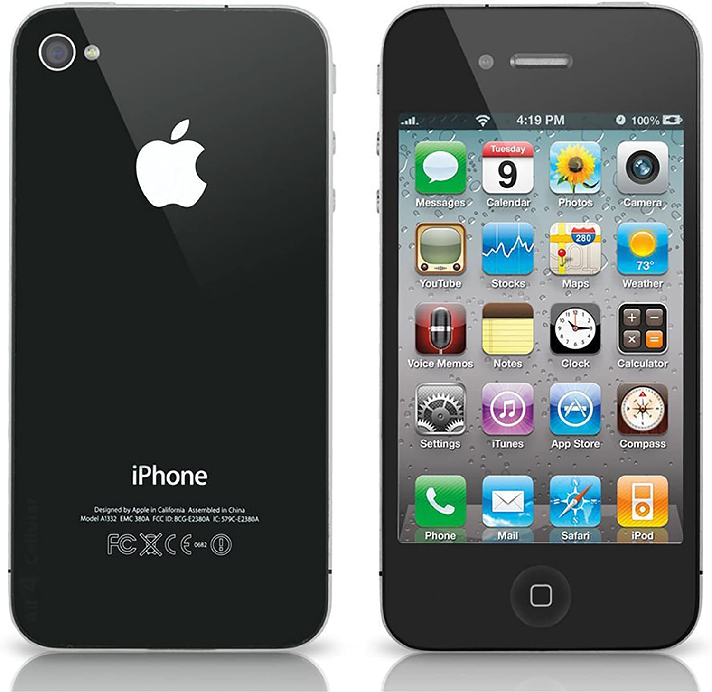
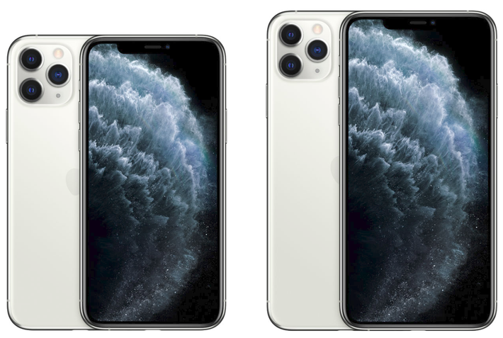

# L'évolution du iPhone
## Le iPhone 2G

Le iPhone 2G était le premier téléphone tactile inventé. C'était le fusion du ipod et du téléphone de maison. Il avait un écran de 3,5 pouces 320 x 480 pixels et une caméra de 2-mégapixels.

## Le iPhone 3G

Le iPhone 3G était pareil que le 2G, mais avait en plus un GPS intégré, des services de locations comme l'application Maps et était aussi capable de se connêcter aux reseaux 3G plus rapidement.

## Le iPhone 4

Le iPhone 4 était un tout nouveau téléphone de l'intérieur avec la fonction de faire des appels FaceTime et de l'exterieur avec un écran tactile de 640 x 960 pixels et une caméra de 5 mégapixels.

## Le iPhone 5

Le iPhone 5 avait un écran de 4 pouces 640 x 1,136 pixels 

## Le iPhone 6

Le iPhone 6 était le premier iPhone à avoir Touch-ID ce qui voulait dire qu'il y avait un capteur pour lire ton empreinte digitale pour débloquer ton téléphone. Il avait aussi l'habileté de prendre des photos en 1080p.

## Le iPhone 7

Le iPhone 7 avait une caméra de 12 mégapixels ce qui était une différence de 7 mégapixels comparé au dernier iPhone.

## Le iPhone 8

Le iPhone 8 était le premier à avoir un derrière de vitre à la place de l'aluminium. Il pouvait aussi prendre des photos et des vidéos en 4K.

## Le iPhone X

Le iPhone X avait 2 caméras, une de 12 mégapixels et une autre pour le zoom de 2x et 10x. Il avait aussi une nouvelle caractéristique, le FaceID qui pouvait débloquer ton téléphone avec un scan de ton visage.

## Le iPhone 11

Le iPhone 11 avait 2 caméras de 12 mégapixels avec une nouvelle fonction pour chaque caméra ce qui était le wide et le ultra wide qui pouvait aller jusqu'à une angle de vue de 120°.

## Le iPhone 11 Pro/Pro Max

Le premier modèle de iPhone à avoir 3 caméras de 12 mégapixels avec plusieurs nouvelles fonctions comme le mode portrait qui pouvait controller la profondeur des photos prises.
